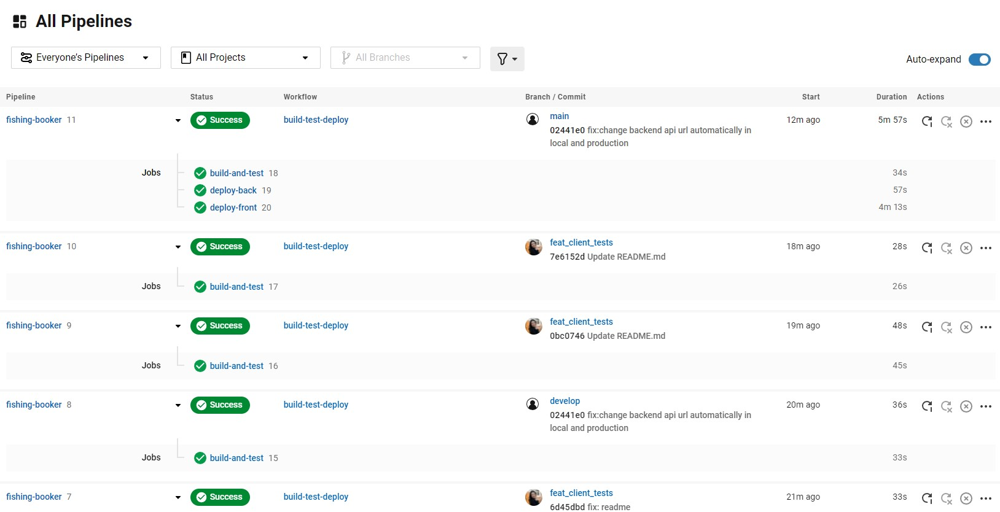
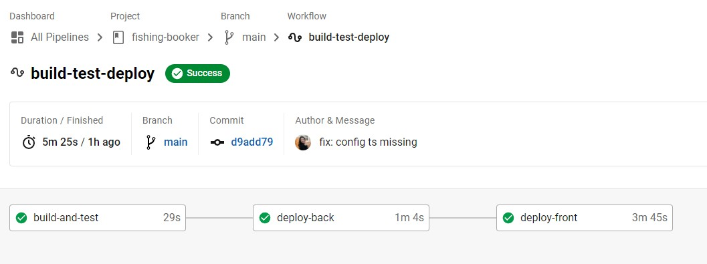
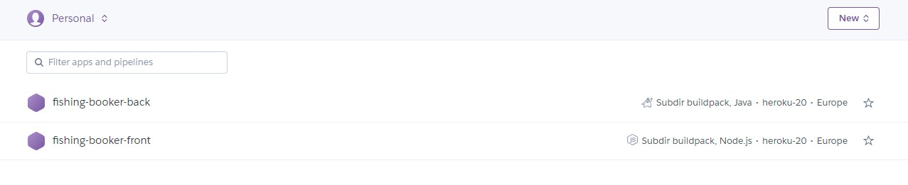

# Fishing Booker - Full Stack Academic Project (ISA)
 


[](https://fishing-booker-back.herokuapp.com/)
[](https://fishing-booker-front.herokuapp.com/)


Full stack academic ISA project. Web application for renting fishing equipment, boats and instructors.
Project made for Faculty of Technical Sciences' course Internet Software Architectures.

## Starting the Application

### Heroku

Backend: [](https://fishing-booker-back.herokuapp.com/)

Frontend: [](https://fishing-booker-front.herokuapp.com/)

### Locally

To start the Spring Boot application, make sure you have a Postgres database `fishing-booker` ready. Default postgres user name is `postgres`. In the `application.properties` file, setup the required Enviromental Variables to suit your needs. If you decide on running the tests, verify their enviromental variables as well. Applications URL on local is `https://localhost:8080`. 

This is the list of enviromental variables you need: **PASS** (your database password), **EMAIL**, **EPASS** (email password), **APP_URL**
**PictureLocations** (absolute path to the assets\images folder of angular frontend application.Example:C:\Users\Djordje\Desktop\Folder_u_kom_se_projekat_nalazi\Frontend\fishing-booker\src\assets\images)

For the Angular application have the backend running, and run the following commands:
```
npm install 
ng serve
```

## Testing Accounts' Info

**Client:**
`client.email@fishing.com    pass: 123`

**Cottage Owner:**
`cottage@fishing.com    pass: 123`

**Boat Owner:**
`boat@fishing.com    pass: 123`

**Fishing Instructor:**
`adventures@fishing.com    pass: 123`

**Administrator:**
`admin@fishing.com    pass: 123`

## Tools Used

- Spring Boot
- Angular
- PostgreSQL
- Lombok
- Heroku
- CircleCI
- PowerDesigner
- Adobe Photoshop 2020


## Devops Flow: CircleCI, Heroku





## Sacalibility & Concurrent Database Access

 In the folder `docs` you may find separate folders for each student's implementation for the task **4.4 - Concurrent Database Access**.
 In the said folder you will also find the [**Proof of Concept**](https://github.com/tara-pogancev/fishing-booker/blob/main/docs/Proof%20of%20Concept.pdf) PDF, made for the task **4.8 - Scalability**, as well as the database scheme (PowerDesigner file).

## Resources

- [Google Fonts](https://fonts.google.com/)
- [Unsplash](https://unsplash.com/)
- [Flaticon](https://www.flaticon.com/)
- [unDraw](https://undraw.co/illustrations)
- [ManyPixels](https://www.manypixels.co/gallery)
- [FreePik](https://www.freepik.com/vectors/illustrations)
-[Shields IO](https://shields.io/)

## Authors

► Tara Pogančev, RA80/2018 (student 1)

► Miloš Živić, RA75/2018 (student 2)

► Đorđe Krsmanović, RA71/2018 (student 3)

## Screenshots


